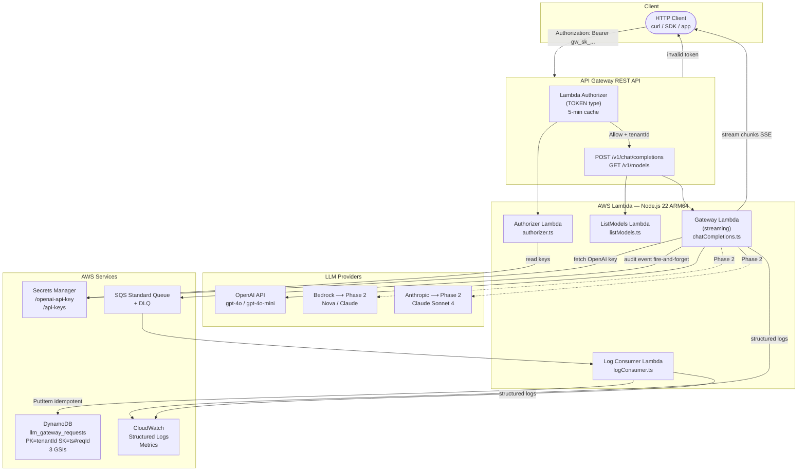
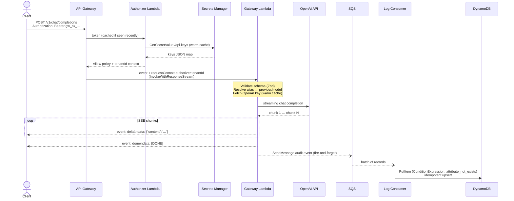
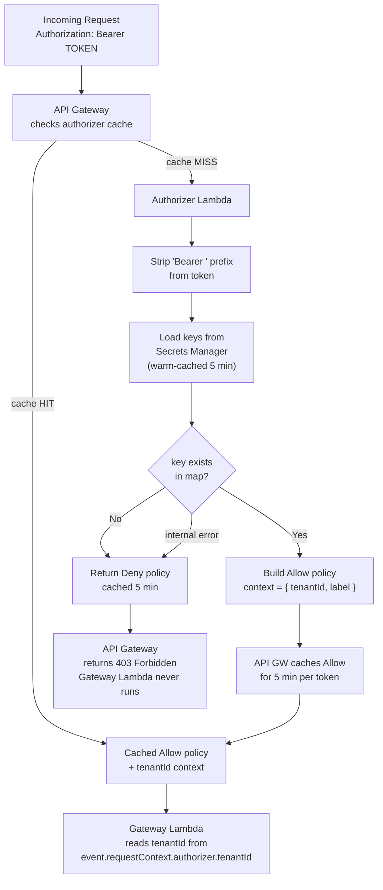
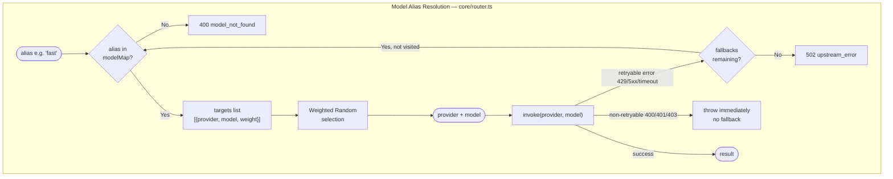

# Architecture Diagrams

## 1. System Architecture

---

## 2. Request Flow — Streaming Path

---

## 3. Auth Flow — Lambda Authorizer

---

## 4. Routing Logic — Alias Resolution & Fallback Chain

